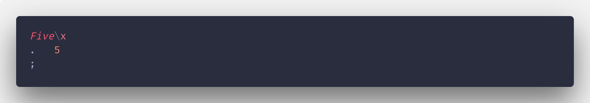
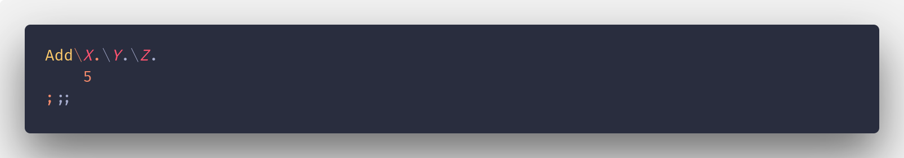
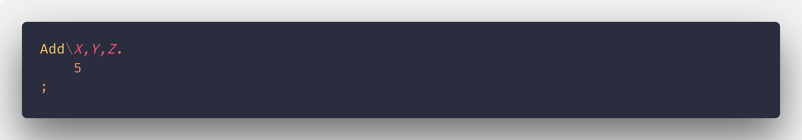
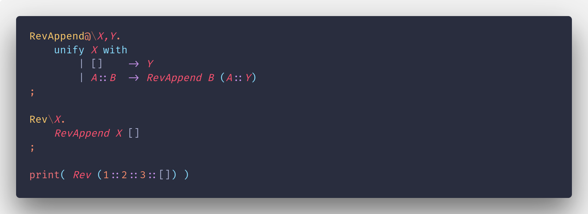
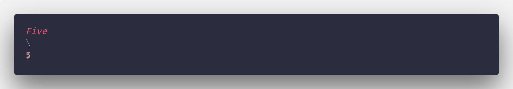
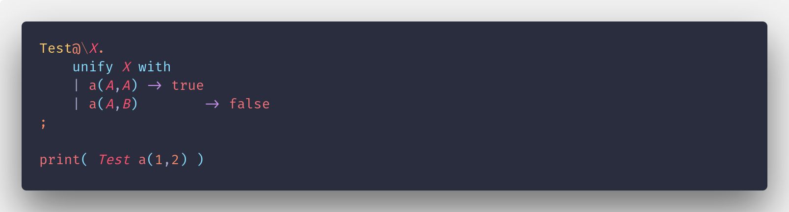

# Lambda Script

Lambda Script is a small prototype of an interpreted language build using OCaml.
This project aim to build a fully pure functionnal script language.

This project come from a course from which I wanted to go further.

## Getting Started

If you want to try this language here are the few steps.

### Prerequisites

First you need to have ocaml on your computer.
For this, here is the link to install it :

https://ocaml.org/docs/install.html


### Building the intrepeter

For testing the language you juste need to use make to build the intrepeter from the sources :

```bash
git clone https://github.com/CuadrosNicolas/LambdaScript
cd ./LambdaScript
make
```

## Testing the language

If you want to test the language use directly the examples provided with the sources :

```bash
last ./Examples/array.last
```

## Syntax of the language

The language is inspired by OCaml, Prolog and python abut his syntax is mostly taken from OCaml.

### Functional

This language is purely functional, which mean you can't make any affectation(except for printing).

### Basic types

- Int : 12
- Float : 12.5
- String : "Hello world !"
- List : 1::2::[] , note that the '[]' at the end is not mandatory but help for parsing
- Tuple : (1,2)
- Atom : a, they are variable with their name as value (must begin with a lower case letter)
- NamedTuple : a(1,2), begin with an atom, and followed by a tuple.

### Basic operations

- print : printing operation
- \+ : addition between int or float/ concatenation for list
- \- : substraction
- \* : multiplication
- /  : division
- () : Parentheses for priority
- :: : linker for creating list

### Functions

#### Definition



Functions always began with an upper case letter, argument are declared between the '\' and '.'; the function end after the ';'
A function can only have one arguments but since it could be boring chaining function like that :



You can use the some syntatic sugar to do the same thing :



Lambdas are also possible by juste omitting the name.

#### Recursion

Recursive function can be defined by add a '@' after the name of the function.
For example, here is the implementation of the reverse function from ocaml into last :



### Expressions

Expression are basically function without argument you can define them like that :



### Pattern matching (Unification)

Pattern matching work exactly like OCaml but only one difference, you can specify a multiple time the same variable in the pattern which mean that these variables are the same, for example :



Will print false, since the composant of a(1,2) are not the same.
You can use the '_' to specify an any value to match everything.

## Syntax highlighting

If you want to have a simple syntax highlighting for testing in the best condition, check out this extension for Visual studio code :

https://github.com/CuadrosNicolas/ambda-script-syntax-highlighting

## ToDos

The langugage is not yet fully working, here is the list of the next features to come :

- [ ] Postcondition for pattern matching
- [ ] Type conversion
- [ ] String manipulation operators
- [ ] Modulo operator
- [ ] Module management
- [ ] Exception catching
- [ ] File read and writing
- [ ] Regex matching for strings
- [ ] Syntaxic sugar for building list
- [ ] Hastable data structure
- [ ] Static analysis in order to get informations about the program
- [ ] Adding information in case of failure while executing a script
- [ ] JSON file loading
- [ ] Calling python program

## Built With

* [OCaml](https://ocaml.org/docs/install.html) - The web framework used


## Authors

* **[Cuadros Nicolas](https://github.com/CuadrosNicolas)** - *Initial work*


